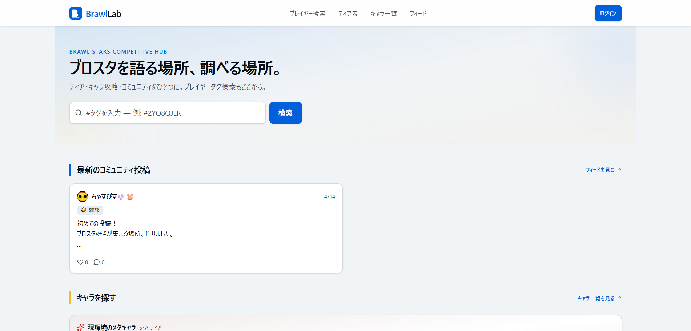
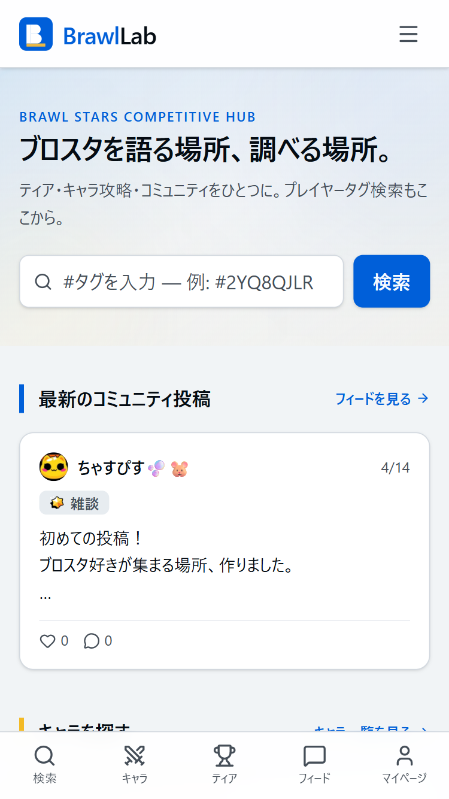
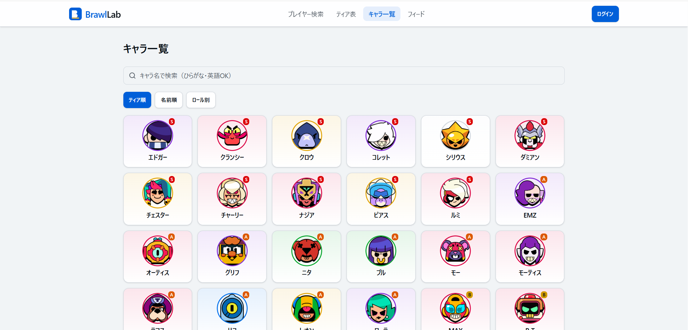
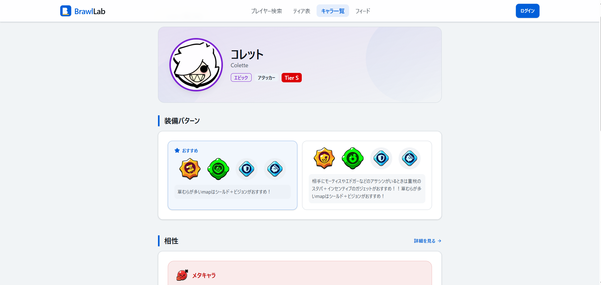
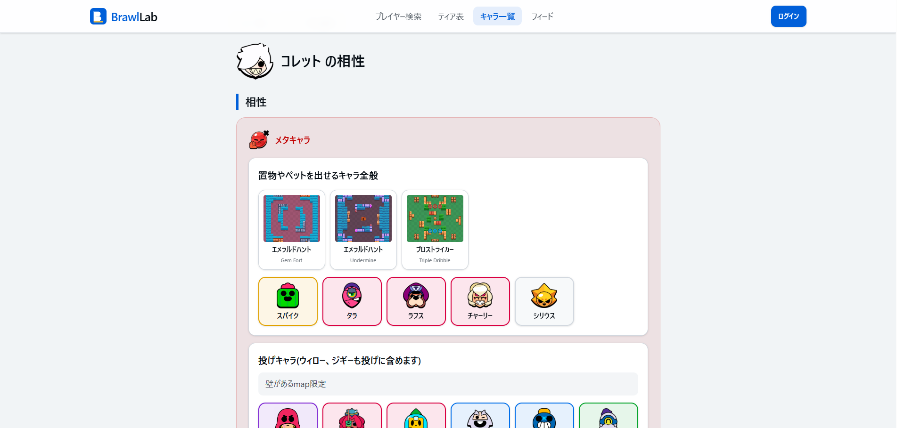
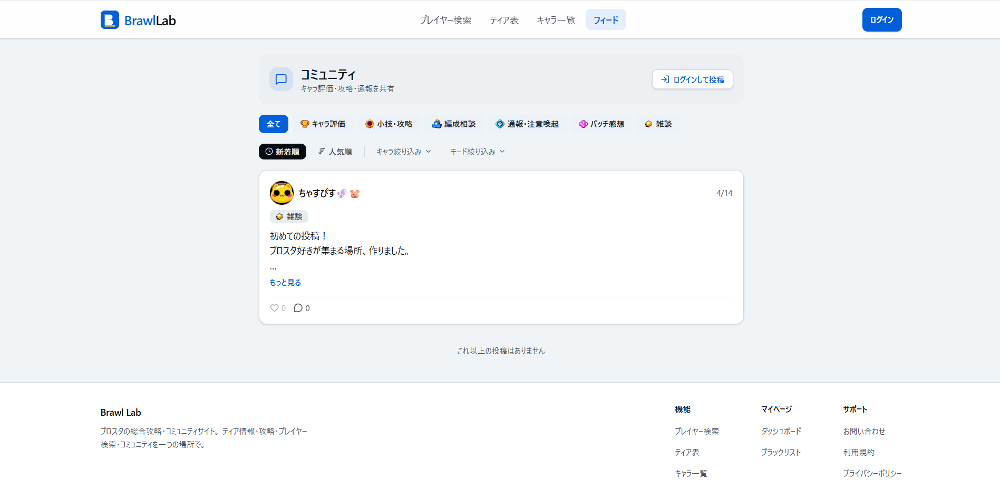
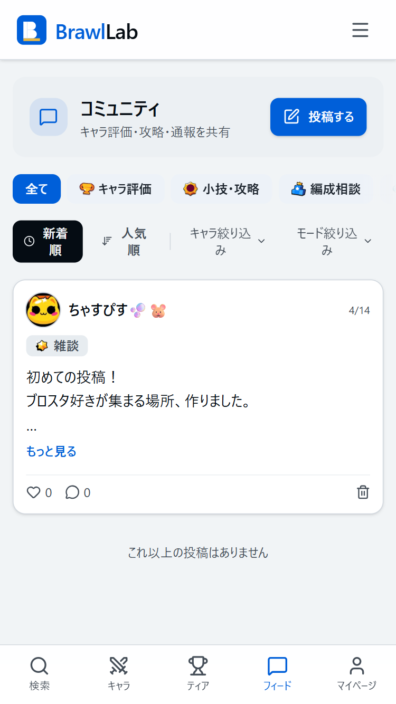
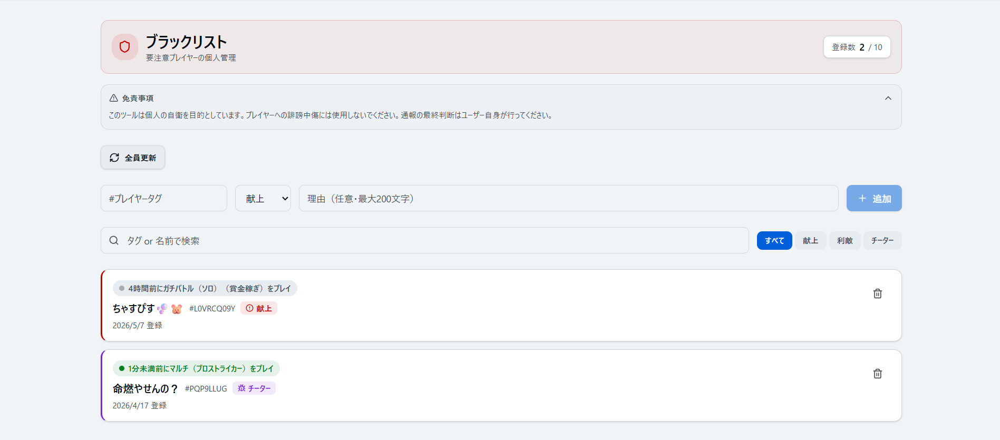

# BrawlLab

> 初心者から上級者まで、ブロスタの攻略情報とコミュニティを一つにまとめた日本語プラットフォーム

**Live Site**: https://brawl-lab.com/
**公式TikTok**: [@chasupisu](https://www.tiktok.com/@chasupisu)

  

  
  
  

---

## ハイライト

- **個人開発 1.5ヶ月** — 企画 / 設計 / 実装 / インフラ / 運用 / グロースまで一人で担当
- **TikTok 1ヶ月でフォロワー1,000人達成** — サイトと連動したグロース戦略を並行運営
- **配信経由で約¥10,000の収益化** — 早期ユーザーから直接フィードバック収集中
- **Next.js 16 (App Router) + Supabase + Cloudflare R2** — モダン構成で本番運用中

## このプロジェクトについて

BrawlLab は、ブロスタプレイヤーが **「最新の攻略・ティア情報の取得」** と **「他プレイヤーとの議論・交流」** を一つのサイト内で完結できることを目指した、日本語ユーザー向けの総合プラットフォームです。

既存の日本語コミュニティはX（Twitter）やDiscordに分散しており、攻略情報サイトとコミュニティが分断されているという課題から開発を始めました。

| 項目 | 内容 |
|------|------|
| 開発期間 | 2026年3月 〜 現在（約1.5ヶ月） |
| 開発体制 | 個人開発 |
| ステータス | ソフトローンチ中（フィードバック収集フェーズ） |
| ソースコード | 個人運営サービスのため非公開。技術詳細・実装についてはご相談時に共有可能です |

---

## なぜこのプロダクトを作ったか

### 市場背景

Brawl Stars はグローバルで月間アクティブユーザー約 **5,000万人**（2026年時点の推定値）を抱える、Supercell 社のモバイル対戦ゲームです。日本もアジア圏の主要マーケットの一つでありながら、日本語ユーザー向けの攻略・コミュニティツールは、グローバル英語圏のサービスと比較して以下の点で遅れていると感じていました。

### 課題

#### 1. 既存の日本語攻略サイトの内容が浅い
既存の日本語攻略サイトは更新自体は行われているものの、「強キャラ紹介」レベルの表面的な情報に留まっているものが多く、**「いま何が強いか」「なぜ強いか」「どう対処するか」までを噛み砕いた一次情報が日本語で見つからない** というのが、私自身プレイヤーとして長年感じていた不満でした。

#### 2. コミュニティが分散し、検索性・蓄積性に欠ける
情報交換は X（旧Twitter）や Discord に分散しており、それぞれ以下の課題があります。

- **X**: タイムラインに流れて消える、特定キャラ・モード単位での議論が追いにくい
- **Discord**: クローズドで検索性が低く、初心者が新規参加しづらい

「あのキャラの相性はどうだったか」「このマップでの立ち回りは」といった **ストック型の議論が積み上がる場所** が日本語圏には存在しない、というのが私の観察です。

#### 3. 不正対策（チーター・利敵行為）の自衛手段が乏しい
近年プレイヤー間で問題になっているチート行為や利敵（Win-trading）について、**「対戦相手が要注意プレイヤーかどうかを事前に判断する仕組み」がプレイヤー側に提供されていません**。Supercell の対応待ちでは限界があり、コミュニティ主導での可視化が必要だと考えました。

### ターゲットユーザー

最初に獲得したい中心ユーザーは **「ブロスタを始めて間もない初心者層」** です。

- 「何から始めればいいか分からない」
- 「キャラが多すぎて誰を育てればいいか判断できない」
- 「ネットで調べても情報がバラバラで信頼できない」

この層に対し、**「ここに来れば一通りの判断材料が揃う」** という体験を提供することを最初のゴールに設定しています。中級者・上級者層は、コミュニティ機能を通じて議論の主役として巻き込んでいく設計です。

### 私の原体験

私は **約8年間ブロスタをプレイしている長期ユーザー** で、以下のような「あったらいいのに」を自分自身が繰り返し感じていました。

- **キャラ相性の体系的なまとめ**: 「このキャラはこのキャラに弱い」という暗黙知が日本語で構造化されていない
- **チーター・利敵プレイヤーの自衛**: 対戦中に「この動きは怪しい」と感じても、判断材料が手元にない

これらの課題に対し、現在以下の機能を **実装・公開済み** です。

- **キャラ相性表**: どんなキャラに有利不利なのかを構造化して可視化
- **個人ブラックリスト**: 自分用の要注意プレイヤーリストをオンライン状況付きで管理
- **コミュニティフィード**: キャラ・モード単位でストック型の議論ができる投稿・コメント機能

次フェーズでは、コミュニティ機能内に **「通報・注意喚起」カテゴリ** を設け、チーターらしき行為の目撃情報をユーザーが投稿・共有できる場として展開していく計画です。これにより、個人単位の自衛情報がコミュニティ全体の集合知へと発展する設計を狙っています。

BrawlLab はこの **「自分が欲しかったもの」** をプロダクト化したサービスです。長期プレイヤーとしてのドメイン知識と、ゲーム外（コミュニティ・運営側）の課題感の両方を解決することを目指しています。

---

## 技術スタック

### 全体構成

| レイヤー | 採用技術 |
|---------|---------|
| フロントエンド | Next.js 16 (App Router) + TypeScript |
| スタイリング | Tailwind CSS v4 |
| 認証 | Supabase Auth（Google / Discord OAuth） |
| データベース（本番） | Supabase (PostgreSQL + Row Level Security) |
| データベース（開発） | Supabase ローカル環境（Docker） |
| ファイルストレージ | Cloudflare R2 |
| ホスティング | Vercel |
| 外部API | Brawl Stars 公式 API / Brawlify API |

### 選定理由

#### Next.js 16 (App Router) + TypeScript
アルバイトでの実務経験があり、最も手に馴染んでいるスタックを選びました。**個人開発で1.5ヶ月という短期間で形にする** という制約を最優先し、学習コストよりも実装速度を取った判断です。App Router の Server Components を活用することで、データ取得の大半をサーバーサイドに寄せ、クライアントバンドルを軽量に保っています。

#### Supabase (PostgreSQL + Auth)
**DB と認証をワンストップで提供してくれる点** が決め手でした。Phase1 で必要な「OAuth ログイン（Google/Discord）」「PostgreSQL」「Row Level Security」がすべて標準で揃っており、認証基盤を自前構築する工数を丸ごと削減できます。RLS による「テーブル単位のアクセス制御をDB側で完結させる」設計思想が、個人開発のセキュリティ運用と相性が良いと判断しました。

開発環境では Supabase が公式提供する **ローカル開発用 Docker イメージ** を使用し、本番と同一構成のまま安全にスキーマ変更を試せる体制を整えています。アプリケーション本体は `npm run dev` で起動するシンプルな構成です。

#### Tailwind CSS v4
**デザインが専門外のため、ゼロから CSS 設計を起こすコストを下げる目的** で採用しました。v4 から導入された `@theme` ディレクティブでデザイントークンを一元管理する設計に乗ることで、`bg-primary` / `text-muted-foreground` といったセマンティックな命名でスタイルを統一しています。AI コーディング支援（Claude Code 等）との相性が良く、ユーティリティクラスベースの方が AI に意図を伝えやすいという実用的な側面も決め手の一つです。

#### Cloudflare R2
**動画・画像の保存先として、エグレス料金が無料である点** がコスト面で決定的でした。今後 TikTok 連動やコミュニティへの動画埋め込みでメディア配信量が増えることを見越し、AWS S3 や他の S3 互換ストレージと比較した結果、長期運用コストを最小化できる R2 を採用しています。

#### Vercel
**Next.js との親和性と、GitHub 連携による Push-to-Deploy の手軽さ** が選定理由です。プレビュー環境が PR 単位で自動生成されるため、ソフトローンチ中のフィードバック検証もスムーズに行えます。

### AWS を選ばなかった理由

クラスメソッド様に向けて補足すると、本プロジェクトでは **個人開発における運用負荷とコストの最小化を最優先** し、AWS ではなく Vercel + Supabase + Cloudflare R2 のフルマネージド構成を採用しました。

ユーザー数が伸び、運用要件（VPC 内通信、独自ドメインの SSL 証明書管理、IAM ベースの権限設計など）が複雑化したフェーズでは、AWS（特に ECS / RDS / S3 / CloudFront）への段階的な移行も選択肢として視野に入れています。現時点では **「最小の運用コストで、ユーザー検証サイクルを最速で回すこと」** を技術選定の基準に置いた結果としての構成です。

---

## 主要機能

公開済み機能のうち、本プロジェクトの中核となる3領域を紹介します。

---

### 1. キャラクター情報（一覧 / 詳細 / 相性詳細）

ブロスタは2026年現在 80体以上のキャラクターが存在し、それぞれに装備（スターパワー / ガジェット / ギア）と相性関係が紐づきます。BrawlLab ではこの情報を **3階層** に分けて整理しています。

  

▲ キャラ一覧：全キャラをグリッドで一覧表示

  

▲ キャラ詳細：推奨装備と主要な相性情報を1ページで把握

  

▲ キャラ相性詳細：「射程負けキャラ」「投げキャラに弱い」などのテーマごとに、該当キャラをグループ化して可視化

#### 機能のポイント
- **キャラ一覧**: 全キャラを横断的にブラウズできるエントリーポイント
- **キャラ詳細**: 1キャラ単位で「どの装備にすべきか」「主にどんなキャラと有利不利があるか」を集約
- **キャラ相性詳細**: 全キャラを総当たりで並べる従来型のマトリクスではなく、**「射程負けキャラ」「投げキャラに弱い」といったプレイヤー目線のテーマでグループ化** して整理。マップ条件（例：開けたMap限定）などの文脈情報も併記し、実戦で判断の助けになる形に落とし込んでいます

#### 技術的な工夫
- キャラ画像は外部 API（Brawlify）から取得し、独自のヘルパー関数（`src/lib/brawlstars/assets.ts`）でURLを一元管理
- ティア・レアリティに応じたカラートークン（`tier-s` / `rarity-legendary` 等）を Tailwind v4 の `@theme` で定義し、視覚情報の一貫性を担保

---

### 2. コミュニティフィード

キャラ・モード単位でストック型の議論ができる、日本語ユーザー向けの投稿/コメント機能です。X や Discord に分散していた情報を「タグで絞れる」「検索可能」「議論が積み上がる」形で集約することを目指しました。

  

▲ PC：カテゴリタブとキャラ・モードタグで絞り込み可能な投稿一覧

  

▲ Mobile:スマホでの操作性を重視したUI

#### カテゴリ構成（実装済み）
投稿は用途別に以下のカテゴリで整理されています。

| カテゴリ | 用途 |
|---------|------|
| キャラ評価 | キャラの強さ・性能評価 |
| 小技・攻略 | テクニック・立ち回りの共有 |
| 編成相談 | パーティ構成・ピックの議論 |
| 通報・注意喚起 | チーター・利敵プレイヤーの目撃情報共有 |
| パッチ感想 | アップデート後の所感・メタ変化議論 |
| 雑談 | カジュアルなコミュニケーション |

#### 機能のポイント
- **キャラタグ・モードタグ**: 投稿に複数タグを付与でき、タグから該当する議論だけを絞り込み可能
- **モバイルファースト**: ブロスタユーザーの大半がスマホプレイヤーであることを踏まえ、モバイル体験を最優先に設計
- **「通報・注意喚起」カテゴリ**: チーター・利敵プレイヤーの目撃情報をユーザーが共有することで、個人単位の自衛情報をコミュニティ全体の集合知へと昇華させる場として機能

#### 技術的な工夫
- 投稿一覧は Server Components で取得し、初期表示の高速化と SEO の両立を実現
- 認証・投稿操作のみ Client Components に分離し、クライアントバンドルを最小化
- Supabase の Row Level Security により「自分の投稿のみ編集・削除可能」を DB 側で完結

---

### 3. 個人ブラックリスト（オンライン状況疑似表示付き）

要注意プレイヤーを自分専用のリストに登録し、**「いまその人がプレイ中かどうか」を疑似的に表示** できる機能です。Supercell の公式 API はリアルタイムのオンライン状況を提供していないため、独自のロジックで擬似的に再現しています。

  

▲ 個人ブラックリスト:オンライン状況アイコンと最終プレイ情報を表示

#### 機能のポイント
- **疑似オンライン状況**: バトルログの `battleTime` と現在時刻の差分から「最近プレイしているか」を推定
  - 5分以内: オンラインの可能性が高い
  - 5〜30分: 最近プレイ
  - 30分以上: オフライン
  - データなし: 不明
- **通報種別バッジ**: 献上 / 利敵 / チーターの3種別で色分け
- **最大10件の上限**: 個人での自衛目的に絞り、機能を意図的に制限

#### 技術的な工夫
- **キャッシュ戦略**: 公式 API のレート制限（1,000 req/min）を超えないよう、`player_cache` テーブル（5分TTL）で全ユーザー横断のキャッシュを実装。**他ユーザーが同じプレイヤーを検索済みであればキャッシュヒットし、API コールが発生しない**
- **「全員更新」ボタン**: 一括更新時もキャッシュ済み分はAPIコールをスキップし、進捗バー付きで順次取得
- **RLS 設計**: 自分のブラックリストは自分しか閲覧・編集できないよう、PostgreSQL のポリシーで強制

---

## 設計上の工夫

公開していない実装の代わりに、本プロジェクトで採用した主要な設計判断を4つ紹介します。いずれも「個人開発・短期間・将来のスケール」という制約のもとで、トレードオフを意識して選択したものです。

---

### 1. キャッシュ戦略：Phase別の段階移行

ブロスタの公式 API は **1,000 req/min** というレート制限があります。同じプレイヤーを複数ユーザーが検索するケースは多発するため、**ユーザー横断で共有されるキャッシュ** が必須でした。

**Phase1（現在）の実装**
Supabase の `player_cache` テーブルに以下の戦略でキャッシュしています。

- **5分 TTL**: ブロスタのバトル間隔（おおむね3〜5分）に合わせ、新鮮さとAPI節約のバランスを取る
- **全ユーザー横断**: 一度誰かが取得したデータは、他ユーザーが検索した際にもキャッシュヒットする設計。これにより MAU が増えても API コール数は線形には増えない
- **キャッシュキーの最適化**: プレイヤータグごとに「プロフィール」「バトルログ」を独立してキャッシュし、必要なものだけ更新

**Phase2 への移行判断基準**
将来的には Upstash Redis への移行を計画していますが、**現時点ではユーザー数が限定的なため、移行は急務ではない** と判断しています。一般的に以下のような兆候が出たタイミングで移行を検討する想定です。

- DB のレイテンシ悪化（キャッシュアクセスのレスポンスがユーザー体感に影響し始める）
- Supabase の Read 課金や接続数が想定コストを超えてくる
- DB の本来のクエリ（投稿・コミュニティ機能など）がキャッシュ用途のクエリに圧迫される

「使われていない段階でインフラを過剰設計しない」という判断のもと、**まずは PostgreSQL で動かしきって、運用しながら判断する** 構成にしています。

---

### 2. Row Level Security でセキュリティ境界を DB に集約

個人開発で最も避けたかったのが **「アプリ層のバグでデータが他ユーザーに漏れる」** リスクです。BrawlLab では Supabase の Row Level Security (RLS) を全面的に活用し、**アクセス制御の最終境界を DB 側に寄せる** 設計を取りました。

具体的には、ユーザー固有のデータ(個人ブラックリスト、通報レポート、自分のプロフィール)は **「自分しか SELECT/INSERT/UPDATE/DELETE できない」** というポリシーを各テーブルに定義しています。これにより以下が実現できます。

- API ルートで `where user_id = ?` を書き忘れても、DB が拒否する
- アプリ層の実装ミスがあっても、データ漏洩のリスクが最小化される
- 認可ロジックの重複定義（API 層 + DB 層）を避けられる

「アプリ層は信用しない、DB が最終防衛線」という設計思想は、個人開発では特に重要だと判断しました。

---

### 3. Server Components 優先のデータ取得方針

Next.js 16 の App Router では、データ取得の場所として「Server Components」「Route Handler (API Route)」「Client Components」の3択があります。BrawlLab では以下の使い分けを徹底しました。

| 用途 | 採用 |
|------|------|
| 一覧ページの初期データ取得（投稿一覧・キャラ一覧など） | **Server Components** |
| ログイン後のユーザー固有データ取得 | **Server Components** |
| ユーザー操作によるデータ変更（投稿・いいね・削除） | **Route Handler 経由** |
| リアルタイム性が必要な部分（フォーム入力・モーダル制御） | **Client Components** |

**狙い**:
- **クライアントバンドルの軽量化**: モバイルユーザー（ブロスタの主要層）の初期表示速度を優先
- **SEO の確保**: 攻略情報サイトとして検索流入を狙うため、サーバーレンダリングを基本に
- **API キーの隠蔽**: Brawl Stars 公式 API のキーをクライアントに露出させない

「Client Components が必要な箇所だけ `'use client'` を付ける」という Next.js 16 の設計思想に素直に従う、というシンプルな方針です。

---

### 4. AI コーディング支援（Claude Code）を前提にした開発体制

本プロジェクトは **Claude Code を主要な開発パートナーとして活用** しながら、1.5ヶ月という短期間で実装まで到達させました。AI を「補助」ではなく「常時併走するペアプログラマ」として位置づける前提で、リポジトリ構造そのものを AI と協働しやすい形に整えています。

**具体的な工夫**:

- **`CLAUDE.md` の整備**: プロジェクト概要・技術選定理由・コーディング規約・デザインシステムのルールをルートに集約。新しい会話を開始するたびに AI が同じ前提で動けるようにし、「毎回同じ説明を繰り返す」負荷を排除
- **機能仕様書の分離**: `docs/features/` 配下に機能ごとのスペック（UI構成、API、DB、受け入れ条件、エッジケース）を独立した Markdown で記述。実装依頼時に「この仕様書に沿って実装して」と渡すだけで設計の一貫性が保たれる
- **デザインシステムのトークン化**: Tailwind v4 の `@theme` ディレクティブでセマンティックトークン（`bg-primary` / `text-tier-s` 等）を定義。AI が「青色を使って」ではなく「primary トークンを使って」と指示を解釈できるようにし、デザインのブレを抑止
- **カスタムコマンドの活用**: `.claude/commands/` 配下に頻出タスク（API ルート作成、DB マイグレーション）をコマンド化し、定型作業を自動化

「AI が書いたコードを人間がレビューする」という開発フローを前提に、**仕様の明文化とトークン化に時間を投資することで、実装速度を加速させる** という方針を取っています。これは個人開発で短期に成果を出すための戦略であると同時に、今後 AI コーディング支援が一般化していく時代における **チーム開発の予行演習** としての位置づけも持たせています。

---

## グロース戦略

BrawlLab は「作って終わり」のプロダクトではなく、**ユーザー獲得まで一気通貫で設計** することを最初から方針に据えています。サイト本体の開発と並行して TikTok アカウントの運営・ライブ配信を行い、サイト ⇄ SNS の循環を生み出す導線を構築中です。

### 戦略の全体像

TikTok（短尺動画）  →  プロフィールリンク  →  BrawlLab
↑                                       ↓
└──── ライブ配信で口頭宣伝・URL共有 ────┘

ブロスタプレイヤーの主要層（10〜20代）と TikTok ユーザー層は強く重なっており、また TikTok のアルゴリズムは **フォロワー0からでもバズが起こりうる拡散力** を持つため、新規サービスの認知獲得チャネルとして最適と判断しました。

---

### TikTok 運営実績

公式アカウント: [@chasupisu](https://www.tiktok.com/@chasupisu)

| 項目 | 数値 |
|------|------|
| 開始時期 | 2026年3月21日 |
| フォロワー数 | **1ヶ月で1,000人達成** |
| 投稿頻度 | 週2〜3本（ペース化済み） |
| 投稿ジャンル | ブロスタのプレイ解説動画 |
| 最大再生数 | **34.6万再生**（バズ動画1本） |

#### 試行錯誤と方針転換

最初は **キャラ解説動画** を中心に投稿していましたが、伸びにくく、また編集に時間がかかるためコストパフォーマンスが悪いと判断しました。そこで **8年間のプレイ経験を最大限に活かせる「プレイ解説動画」** に方針転換し、特定の編集スタイル・投稿時間帯・テーマを確立。これにより継続投稿の効率化と再生数の安定化を両立できました。

「市場の反応を見て早めにピボットする」というプロダクト開発の姿勢を、SNS 運営にも適用したアプローチです。

---

### TikTok LIVE 配信

| 項目 | 数値 |
|------|------|
| プラットフォーム | TikTok LIVE |
| 配信頻度 | 週2〜3回 |
| 配信内容 | ブロスタのプレイ配信 |
| 累計収益（開始1ヶ月） | **約 ¥10,000** |

配信は **収益化の場であると同時に、最も貴重なユーザーフィードバック収集チャネル** として機能しています。視聴者にサイトを実際に使ってもらい、配信中に率直な感想を聞くことで、改善点を即座に拾える体制を構築しています。

---

### サイト ⇄ TikTok の連携設計

#### 実装済み（現在稼働中）
- **TikTok プロフィールにサイト URL を設置**:動画視聴 → プロフィール経由でのサイト流入導線を確立
- **配信中の口頭宣伝**:プレイ配信中にサイト機能を実演しながら紹介
- **配信視聴者への URL 共有**:チャットへ直接リンクを投げ、その場で使ってもらう

#### 今後実装予定
- **サイト内への TikTok 動画埋め込み**:キャラ詳細・モード攻略ページに該当する動画を表示し、テキスト情報と動画情報を一体化
- **サイト → TikTok の逆方向導線**:サイト内に TikTok アカウントへのリンクを配置し、循環を完成させる

---

### 現フェーズの位置づけ：ソフトローンチ期

正式な大規模告知の前に、配信視聴者という協力的な初期ユーザー層から1〜2週間程度フィードバックを集めるフェーズに置いています。エラーやUIの違和感が出ることを前提に、本格的なサイト宣伝は安定性が確認できた段階で TikTok 動画として発表する計画です。

---

### 今後の目標

| 指標 | 目標 |
|------|------|
| TikTok フォロワー | **3ヶ月で 5,000人** |
| 配信収益 | **月 ¥50,000** |
| サイト MAU | **半年で 3,000 MAU** |

「コンテンツで集めた視聴者がサイトに流入し、サイトでの体験が SNS でのファン化につながる」という **エンゲージメントの好循環** を作り出すことが、この戦略の最終ゴールです。

---

## 学び・今後のロードマップ

### 技術面で身についたこと

#### 公式APIのレート制限を意識したキャッシュ設計
Brawl Stars 公式 API の **1,000 req/min** という制約のもとで、「どのデータを」「どの粒度で」「どれだけの時間」キャッシュするかを設計する経験を積めました。プレイヤータグ単位のキャッシュ、全ユーザー横断での共有、5分TTL の設定根拠など、**API コール数を線形に増やさないための設計** を実装レベルで理解できたことは、今後どんなサービスを開発する際にも応用できる基礎力になったと考えています。

#### Vercel を用いた本番運用
開発用デプロイだけでは触れない領域 — **独自ドメインの取得・DNS 設定、本番環境変数の管理、本番DBへの接続設定、ログ・エラー監視の設定** — を一通り経験しました。「動くものを作る」と「公開して運用する」の間にある工数を体感したことは、今後業務でサービスをローンチする際にも生きると考えています。

---

### プロダクト・グロース面で身についたこと

#### 「ユーザーからの反応」が新しい原動力になることの発見
当初は **実績作りや収益化** を主目的に始めたプロジェクトでした。しかし運営を続ける中で、配信に来てくれる視聴者から直接フィードバックをもらえること、サイトを実際に使って感想を伝えてくれる人がいるという事実に強い喜びを感じる自分に気づきました。

「自分はこういう **ユーザーと近い距離でプロダクトを育てる** ことが好きなんだ」と発見できたことは、今後のキャリア選択にも影響する重要な気づきでした。

#### スコープ管理の難しさ — 「自分が欲しい」と「ユーザーが必要としている」のギャップ
反省点として、**機能を盛り込みすぎた** 局面が複数ありました。開発の流れの中で「これも欲しい」と着手した機能が、ある程度作ってから「結局そこまで必要ではなかった」と判断して削ることになるケースがあり、工数を無駄にしました。

この経験から学んだのは、**自分が欲しい機能と、大衆が本当に必要としている機能は別物** であるということです。今後は実装に着手する前に、ユーザーの声・配信視聴者の反応・既存の類似サービスの動向をより深くリサーチし、**「本当に必要かどうか」を吟味するプロセス** を意思決定に組み込む必要があると考えています。

---

### 今後のロードマップ

#### 短期（次の3ヶ月）
- **TikTok 動画のサイト埋め込み**:キャラ詳細・モード攻略ページに該当する動画を表示し、テキスト情報と動画情報を一体化
- **コミュニティ機能の活性化**:「通報・注意喚起」カテゴリでのチーター情報集約など、ユーザー投稿が集合知として価値を持つ仕組みの強化

#### 中長期（半年〜1年）
**自前データを活かした AI ボットの開発**

BrawlLab には、キャラ相性・推奨装備・ティア情報など、**私自身が手動で入力・整理した独自データ** が蓄積されています。このデータを Claude API などの LLM に与え、**ユーザーの質問に応答する AI ボット** を構築することを次の大きな挑戦と考えています。

例えば以下のような体験を想定しています。

- 「初心者だけど何から育てればいい？」→ 現在のメタ＋初心者向けキャラを推薦
- 「このマップでこのキャラを使うときの立ち回りは？」→ 蓄積された相性データから根拠付きで回答
- 「このパーティ編成は強い？」→ キャラ間シナジー・相性データから評価

**「人力で蓄積したドメイン知識を、AI で誰でも引き出せる形に変換する」** というコンセプトは、ブロスタというニッチな領域だからこそ実現可能で、競合との差別化にもつながると考えています。

---

## 連絡先

- **Email**: minato.haarunobu3710@gmail.com
- **TikTok**: [@chasupisu](https://www.tiktok.com/@chasupisu)
- **GitHub**: [@HarunobuMinato](https://github.com/HarunobuMinato)
